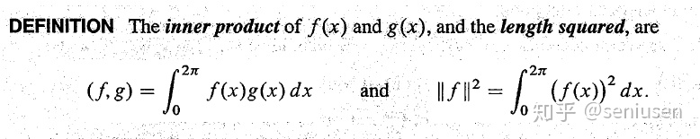
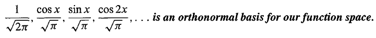
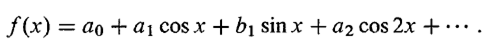
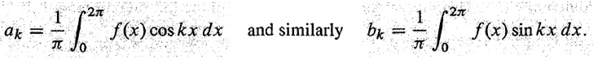

#### 向量空间
$
\begin{aligned}
&{\vec q_1},{\vec q_2},{\vec q_3}\ \ \ is\ an\ orthonormal\ basis \\\\
if\ \ \ &\overrightarrow{V}=x_1 {\vec q_1}+x_2 {\vec q_2}+x_3 {\vec q_3}+\cdots +x_n {\vec q_n}\\\\
then\ \ \ &\displaystyle x_k={\vec {q_k}^\intercal} \cdot \overrightarrow{V}
\end{aligned}
$
#### 函数空间  

#### 一组标准正交基

#### Fourier series

$
f(x)=
    \begin{bmatrix}
    \frac{1}{\sqrt[]{2\pi}}&\frac{\cos x}{\sqrt{\pi}}&\frac{\sin x}{\sqrt{\pi}}&\frac{\cos 2x}{\sqrt{\pi}}&\cdots
    \end{bmatrix}
    \begin{bmatrix}
    A_0\\
    A_1\\
    A_2\\
    A_3\\
    \vdots
    \end{bmatrix}
$
#### 确定傅里叶系数

$
\begin{aligned}
Similar\ to\ vector\ space:  \\
f(x)&\ is\ similar\ to\ \overrightarrow{V}\\\\
\frac{\cos x}{\sqrt{\pi}},\frac{\sin x}{\sqrt{\pi}},\frac{\cos 2x}{\sqrt{\pi}}&\ is\ similar\ to\ {\vec q_1},{\vec q_2},{\vec q_3}\\\\
A_1,A_2,A_3&\ is\ similar\ to\ x_1,x_2,x_3\\
\\
For\ example:\\
&A_1=\int_{0}^{2\pi}f(x)\cdot\frac{\cos x}{\sqrt{\pi}}{\rm d}x\\
Especailly:\\
&A_0=\int_{0}^{2\pi}f(x)\cdot\frac{1}{\sqrt{2\pi}}{\rm d}x = \sqrt[]{2\pi}a_0
\end{aligned}
$
