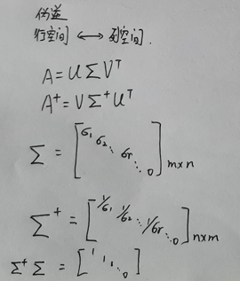

## 线性变换
$\begin {aligned}&T(u+w)=T(u)+T(w)\\&T(cu)=cT(u) \end{aligned}$

Examples:

$\qquad T(0)=0$ yes

$\qquad T(\vec(v))=\Vert \vec{v} \Vert$ no

$A_{m\times n}$

$\begin{aligned} \qquad T:x\in R^n \longrightarrow T(x)\in R^m \end{aligned}$

$\qquad\,\,\,\,\,\,\,\,\,\downarrow \qquad\qquad\,\,\,\,\,\,\downarrow\,\,\,\,\,\qquad\downarrow$

$\qquad\,定义域 \qquad\ \ \ \ 值域\ \ 余定义域$

* 当 值域$\ = R^m \,$时，映上映射
* $A$ 的各列线性无关时一对一映射（单射）$\Longrightarrow Ax=b$ 有唯一解

## 行变换  
* 倍加
* 倍乘
* 对换

## 四个基本子空间
$A_{m\times n}$

$\qquad dimC(A)+dimN(A)=n$

$\begin{aligned} \begin{cases} C(A)\in R^m \ \ \ \longrightarrow dim=rank\\ N(A)\in R^n \ \ \ \longrightarrow dim=(n-rank)\\ C(A^T)\in R^n \ \longrightarrow dim=rank\\  N(A^T)\in R^m \longrightarrow dim=(m-rank)(A^Ty=0) \end{cases} \end{aligned}$

当 $n=m$ 时 , 这些空间更有讨论的意义

## 计算 AB
① $C_{ij}=\displaystyle\sum_{1}^{n}a_{ik}b_{kj}$

② $A\begin{bmatrix} b_1&b_2&\cdots&b_n\end{bmatrix}$

③ $\begin{bmatrix} a_1\\a_2\\ \vdots\\a_n\end{bmatrix}B$

④ 外积

[矩阵乘法核心思想（5）：内积与外积](https://zhuanlan.zhihu.com/p/350470257)

## 可逆矩阵
==基本性质==

* 逆唯一
* $A$各列线性无关
* $\begin{aligned}{\displaystyle (ABC)^{-1}=C^{-1}B^{-1}A^{-1}}\end{aligned}$
* $\begin{bmatrix} A&I\end{bmatrix}\thicksim \begin{bmatrix} I&A^{-1}\end{bmatrix}(Gauss-Jordan)$

==伴随矩阵公式==

$A^{-1}=\displaystyle\frac{adj\ A}{det\ A}\Longleftrightarrow A\cdot adj\ A=det\ A\cdot I$

$\qquad$ 证明：

$\qquad\begin{bmatrix}
a_{11}&a_{12}&a_{13}&\\
a_{21}&a_{22}&a_{23}&\\
a_{31}&a_{32}&a_{33}&\\
\end{bmatrix}
\begin{bmatrix}
C_{11}&C_{21}&C_{31}&\\
C_{12}&C_{22}&C_{32}&\\
C_{13}&C_{23}&C_{33}&\\
\end{bmatrix}=
\begin{bmatrix}
det\ A&0&0\\
\ &det\ A&0\\
\ &\ &det\ A\\
\end{bmatrix}$

$\qquad\qquad$ 注

$\qquad\qquad\  C_{ij}=(-1)^{i+j}det\ A^{'}\longleftarrow \begin{vmatrix}a_{ij}&\ &\ &\ \\\ &\ &\ &\ \\\ &\ &A^{'}\ \\\ &\ &\ &\ \\\end{vmatrix}$

$\qquad\qquad$ 行列式任一行(列)的元素与另一行(列)元素的代数余子式的乘机的和为零

## 克莱姆法则
$\displaystyle x_i=\frac{det\ A_i(b)}{det\ A},i=1,2,3,\cdots,n$

( 当可逆矩阵 $Ax=b$ 的唯一解 )

$\qquad$ ==证明==

$\qquad Ax=b$

$\qquad \Rightarrow A\cdot I_i(x)=A_i(b)$

$\qquad \Rightarrow det\ A \cdot det\ I_i(x)=det\ A_i(b)$

$\qquad \,\,\,\,\,\, (\ det\ I_i(x)=x_i\ )$

$\qquad$ ==几何解释==

$\qquad \displaystyle \frac{det\ I_i(x)}{det\ I}=\frac{det\ A_i(b)}{det\ A}$

## 左右逆
$A_{m\times n}\quad rank=r$

左逆 $\quad {(A^TA)}^{-1}A^T\quad m>n$

右逆 $\quad A^T{(A^TA)}^{-1}\quad m<n$

## 伪逆

## 转置的性质
$A=a_{ij}\qquad A^T=a_{ji}$
$\,$

1. $(A^T)^T=A$
$\,$
2. $(cA)^T=cA^T$
$\,$
3. $(A+B)^T=A^T+B^T$
$\,$
4. $(AB)^T=B^TA^T$

## 分解
$A=CR$

$A=LU$

$A=QR$

$A=QDQ^{T}$

$A=XDX^{-1}$

$A=U\Sigma V^T$