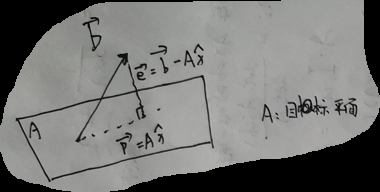

## 性质
单位正交矩阵(列向量单位正交)

**单位正交矩阵的逆等于它的转置**

==证明==

$\qquad A=\begin{bmatrix}a_1&a_2&\cdots&a_n\end{bmatrix}$

$\qquad A^T=\begin{bmatrix}a_1^T\\a_2^T\\\vdots\\a_n^T\end{bmatrix}$

$\qquad A^TA=\begin{bmatrix}a_1^Ta_1&a_1^Ta_2\cdots a_1^Ta_n\\ a_2^Ta_1&a_2^Ta_2\cdots a_2^Ta_n\\\vdots\\a_n^Ta_1&a_n^Ta_2\cdots a_n^Ta_n\end{bmatrix}=I$

## 最小二乘法求最优解
当 $Ax=b$ 无解

$\vec{p}$ 为最优解 , 也即 $\vec{b}$ 在 $A$ 上的投影

$
\begin{cases}
a_1^T(b-A\hat{x})=0\\\\
a_2^T(b-A\hat{x})=0
\end{cases}
$

$\implies\begin{bmatrix}a_1^T\\\\a_2^T\end{bmatrix} (b-A\hat{x})=\begin{bmatrix}0\\\\0\end{bmatrix}$

$\implies A^TA\hat{x}=A^Tb$

由此

① $\hat{x}={(A^TA)}^{-1}A^T\vec{b}$

② $\vec{p}=A\hat{x}=A{(A^TA)}^{-1}A^T\vec{b}$

③ $P=A{(A^TA)}^{-1}A^T$ ( 定义**投影矩阵** $P$ )

( $P^T=P,P^2=P$ )

当 $A_{n\times 1}$ , $P=\displaystyle\frac{aa^T}{a^Ta}$

==一点说明==

若 $A_{m\times n}$ 各列线性无关( 可以不是满秩 ) , 即 $m>n \text{ , } rank\ A=n$ 时 ,  $(A^TA)$ 可逆

$\qquad$ 证明：当 $A^TA\vec{x}=0$ 时 , $\vec{x}$ 只能为 $0$ 向量

$\begin{aligned}
\qquad A^TA\vec{x}=0\\
\qquad \vec{x}^TA^TA\vec{x}=0\\
\qquad {(A\vec{x})}^TA\vec{x}=0\\
\qquad A\vec{x}=0\\
\end{aligned}$

$\qquad A$ 的各列线性无关

$\qquad$ 所以 $\vec{x}=0$

## Gram-Schmidt process
$\begin{cases}
A=a\\\\
B=b-proj_Ab\\\\
C=c-proj_Ac-proj_Bc
\end{cases}$

$\begin{cases}
A=a\\\\
B=b-\displaystyle\frac{A^Tb}{A^TA}A\\\\
C=c-\displaystyle\frac{A^Tc}{A^TA}A-\displaystyle\frac{B^Tc}{B^TB}B
\end{cases}$

( 小 a 表给定的向量 , A 表求得的正交向量 )
( $proj_Ab=Pb$ )