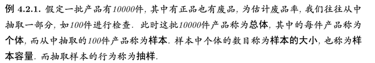

- [数理统计的基本概念](#数理统计的基本概念)
    - [引言](#引言)
    - [基本概念](#基本概念)
        - [总体和样本](#总体和样本)
        - [样本两重性](#样本两重性)
        - [简单随机抽样](#简单随机抽样)
        - [统计模型 (抽样分布)](#统计模型-抽样分布)
        - [统计推断](#统计推断)
    - [统计量](#统计量)

---

# 数理统计的基本概念
### 引言
* 有效地收集数据
* 有效地使用数据
* 归纳

### 基本概念
##### 总体和样本
$\quad$一个数的指标 $\iff$ $X$
大小为 $n$ 的样本 $\iff$ $X_1,X_2,\cdots,X_n$

> 

##### 样本两重性
抽样前：随机变量
抽样后：具体的数

##### 简单随机抽样
* 代表性
* 独立性

显然有放回抽样得到简单样本，但在一定条件下，==无放回也近似可行==

$\begin{cases}
X_1,X_2,\cdots,X_n&相互独立\\
X_1,X_2,\cdots,X_n&相同分布，F
\end{cases}$

> **联合分布**
> $F(x_1)F(x_2)\cdots F(x_n)=\displaystyle\prod_{i=1}^{n}F(x_i)$
> 
> **联合密度**
> $f(x_1)f(x_2)\cdots f(x_n)=\displaystyle\prod_{i=1}^{n}f(x_i)$
> 
> **多维同理**

##### 统计模型 (抽样分布)
1. 假定 样本 $X_1,X_2,\cdots,X_n$ $i.i.d.$
2. 假定 $X_i\backsim N(\mu,\sigma^2)$

$\displaystyle\implies \prod_{i=1}^{n}f(x_i)$

##### 统计推断
从总体抽取一定大小的样本取推断总体的概率分布的方法

1. 提出方法
   * 参数统计推断：参数估计，假设检验（样本的分布形式 $\to$ 未知参数） 
   * 非参数统计推断
2. 推断方法性能的数量指标
3. 寻最优方法，或证明是最优

### 统计量
由**样本**算出的量是**统计量**，或**统计量**是**样本**的函数
* 量中不含未知参数
* 具有两重性
* 统计量的选择需慎重

==若干常用统计量==
| 名称              | 公式                                                                                    |
| :---------------- | :-------------------------------------------------------------------------------------- |
| 样本均值          | $\bar{X}=\displaystyle \frac{1}{n}\sum_{i=1}^{n}X_i$                                    |
| 样本方差          | $S^2=\displaystyle{\color{red}{\frac{1}{n-1}}}\sum_{i=1}^{n}(X_i-\bar{X})^2$            |
| 样本 $k$ 阶原点矩 | $a_k=\displaystyle \frac{1}{n}\sum_{i=1}^{n}X_i^k,k=1,2,\cdots$                         |
| 样本 $k$ 阶中心矩 | $m_k=\displaystyle{\color{red}{\frac{1}{n}}}\sum_{i=1}^{n}(X_i-\bar{X})^k,k=2,3,\cdots$ |

==次序统计量及其有关统计量==

$X_{(1)} \leq X_{(2)} \leq \cdots \leq X_{(n)}$

$(X_{(1)} , X_{(2)} , \cdots , X_{(n)})$ 为**次序统计量**，它的任一部分也是**次序统计量**

1. 样本中位数
2. 极值：$X_{(1)},X_{(n)}$ 为极小值和极大值