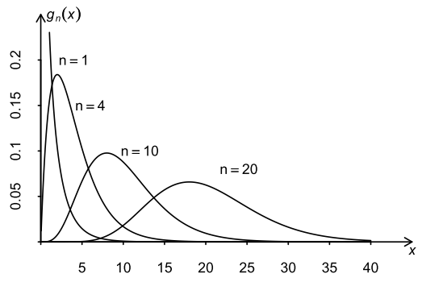
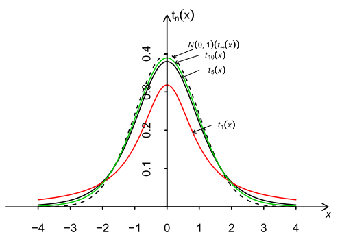
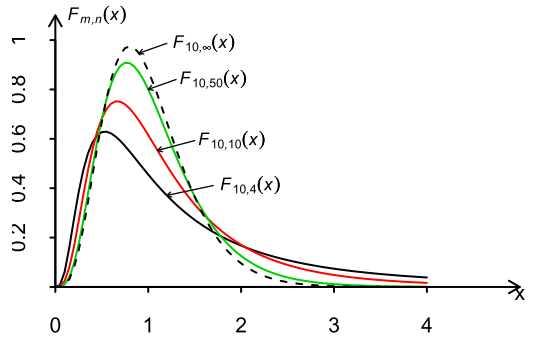

- [三大抽样分布](#三大抽样分布)
    - [$\chi^2$ 分布](#chi2-分布)
    - [$t$ 分布](#t-分布)
    - [$F$ 分布](#f-分布)
    - [正态总体的样本均值与样本方差的分布](#正态总体的样本均值与样本方差的分布)
        - [正态变量线性函数的分布](#正态变量线性函数的分布)
        - [正态变量样本均值和样本方差的分布](#正态变量样本均值和样本方差的分布)
        - [几个重要推论](#几个重要推论)

---

# 三大抽样分布
### $\chi^2$ 分布
① $X_1,X_2,\cdots,X_n\,i.i.d.\backsim N(0,1)$

② $X=\displaystyle\sum_{i=1}^{n}X_i^2$

则称 $X$ 为自由度为 $n$ 的 $\chi^2$ 变量

记为 $X\backsim \chi^2(n)$

==概率密度函数==

$P(X>\chi^2_\alpha(n))=\alpha \qquad \chi^2_\alpha(n)$ 的值查表可得  

$g_n(x)=\begin{cases}
\displaystyle \frac{1}{\displaystyle 2^{\frac{n}{2}}\Gamma(\frac{n}{2})}x^{\frac{n}{2}-1}e^{-\frac{x}{2}}&x>0\\\\
0&其他
\end{cases}$

==图像==

* $n=1,2$ 单调下降趋于0
* $n\geq 3$ 有单峰

==性质==
① $E(X)=n,D(X)=2n$

$\ \\$

② $\begin{rcases}
Z_1 \backsim \chi^2(n_1)\\\\
Z_2 \backsim \chi^2(n_2)\\\\
Z_1\ Z_2 相互独立
\end{rcases}\implies Z_1+Z_2 \backsim \chi^2(n_1+n_2)$

### $t$ 分布
① $X\backsim N(0,1)$

② $Y\backsim \chi^2(n)$

③ $X\,Y$ 独立

④ $T=\displaystyle\frac{X}{\sqrt[]{\displaystyle\frac{Y}{n}}}$

则称 $T$ 为自由度为 $n$ 的 $t$ 的变量

记为 $T\backsim t(n)$

==概率密度函数==

$P(T>t_\alpha(n))=\alpha\qquad t_\alpha(n)$的值查表可得

$t_n(x)=\displaystyle\frac{\Gamma(\frac{n+1}{2})}{\sqrt[]{n\pi} \Gamma(\frac{n}{2})}\left(1+\frac{x^2}{n}\right)^{-\frac{n+1}{2}}\qquad-\infty<x<\infty$

==图像==

* 关于 $x=0$ 对称
* $t(n)$ 的峰值低于 $N(0,1)$ 的峰值
* $\displaystyle\lim_{{n}\to{\infty}}t_n(x)=f(x),f(x)$ 为 $N(0,1)$ 的密度函数

==性质==
① 当 $n\to\infty(>45)\qquad T\backsim N(0,1)$ 

② $n\geq 2\qquad E(T)=0$

③ $n\geq 3\qquad D(T)=\displaystyle\frac{n}{n-2}$
 
### $F$ 分布
① $X\backsim\chi^2(n_1)$

② $Y\backsim\chi^2(n_2)$

③ $X\,Y$ 独立

④ $F=\displaystyle\frac{\frac{X}{n_1}}{\frac{Y}{n_2}}$

则称 $F$ 服从自由度为 $(n_1,n_2)$ 的 $F$ 分布

记为 $F\backsim F(n_1,n_2)$

==概率密度函数==

$P\{F>F_\alpha(n_1,n_2)\}=\alpha\qquad F_\alpha(n_1,n_2)$的值查表可得

$f_{n_1,n_2}(x)\begin{cases}
\displaystyle\frac{\Gamma(\displaystyle\frac{n_1+n_2}{2})n_1^{\frac{n_2}{2}}n_2^{\frac{n_1}{2}}x^{\frac{n_1}{2}-1}}{\Gamma(\displaystyle\frac{n_1}{2})\Gamma(\frac{n_2}{2})\displaystyle(n_1x+n_2)^{\frac{n_1+n_2}{2}}}&y>0\\\\
0&其他
\end{cases}$

==图像==

* 自由度 $n_1,n_2$ 是有顺序的

==性质==
① $Z\backsim F(n_1,n_2)\implies\displaystyle\frac{1}{Z}\backsim F(n_2,n_1)$

② $T\backsim t(n)\implies T^2\backsim F(1,n)$

③ $F_{1-\alpha}(n_1,n_2)=\displaystyle\frac{1}{ F_\alpha(n_2,n_1)}$

关于性质③的证明

$\qquad P(F(n_1,n_2)>F_\alpha(n_1,n_2))=\alpha$

$\implies P(\displaystyle\frac{1}{F(n_1,n_2)}<\displaystyle\frac{1}{F_\alpha(n_1,n_2)})=\alpha$

$\implies P(\displaystyle F(n_2,n_1)<\displaystyle\frac{1}{F_\alpha(n_1,n_2)})=\alpha $

$\iff P(\displaystyle F(n_2,n_1)>\displaystyle\frac{1}{F_\alpha(n_1,n_2)})=1-\alpha$

$\iff P(\displaystyle F(n_2,n_1)>\displaystyle F_{1-\alpha}(n_1,n_2))=1-\alpha$

$\iff \displaystyle\frac{1}{F_\alpha(n_1,n_2)}=F_{1-\alpha}(n_1,n_2)$

### 正态总体的样本均值与样本方差的分布
我想我有必要分析一下这个标题的含义：

正态总体：表明 X 服从正态分布

样本均值与样本方差的分布：表明我们以 X 服从正态分布为先决条件探讨它的样本的一些性质

##### 正态变量线性函数的分布
① $X_1,X_2,\cdots,X_n\,i.i.d.\backsim N(a,\sigma^2)$

② $c_1,c_2,\cdots,c_n$ 常数

③ $T=\displaystyle\sum_{k=1}^{n}c_kX_k$

$\implies T\backsim N(a\displaystyle\sum_{k=1}^{n}c_k,\sigma^2\sum_{k=1}^{n}c_k^2)$

##### 正态变量样本均值和样本方差的分布
① $X_1,X_2,\cdots,X_n\,i.i.d.\backsim N(a,\sigma^2)$

② 样本均值 $\bar{X}=\displaystyle\frac{1}{n}\displaystyle\sum_{i=1}^{n}X_i$

③ 样本方差 $S^2=\displaystyle\frac{1}{n-1}\sum_{i=1}^{n}(X_i-\bar{X})^2$ 

$\implies \bar{X}\backsim N(a,\displaystyle\frac{\sigma^2}{n})$ 

$\implies (n-1)\displaystyle\frac{S^2}{\sigma^2}\backsim \chi^2(n-1)$

$\implies \bar{X}$ 和 $S^2$ 独立

> 证明超出我们的要求

##### 几个重要推论
下面几个推论在正态总体**区间估计**和**假设检验**问题中有着重要的应用

:sunglasses:

① $X_1,X_2,\cdots,X_n\,i.i.d.\backsim N(a,\sigma^2)$

② $T=\displaystyle\frac{\sqrt[]{n}(\bar{X}-a)}{S}$

$\implies T \backsim t(n-1)$

:relieved:

① $X_1,X_2,\cdots,X_m\,i.i.d.\backsim N(a_1,\sigma^2_1)$

② $Y_1,Y_2,\cdots,Y_n\quad i.i.d.\backsim N(a_2,\sigma^2_2)$

③ $X_1,X_2,\cdots,X_m$ 与 $Y_1,Y_2,\cdots,Y_n$ 独立

④ $F=\displaystyle\frac{\displaystyle\frac{S_1^2}{\sigma_1^2}}{\displaystyle\frac{S_2^2}{\sigma_2^2}}$

$\implies F\backsim F(m-1,n-1)$

:scream:

① $X_1,X_2,\cdots,X_m\,i.i.d.\backsim N(a_1,\sigma^2)$

② $Y_1,Y_2,\cdots,Y_n\quad i.i.d.\backsim N(a_2,\sigma^2)$

③ $X_1,X_2,\cdots,X_m$ 与 $Y_1,Y_2,\cdots,Y_n$ 独立

④ $T=\frac{\displaystyle\frac{(\bar{X}-\bar{Y})-(a_1-a_2)}{\sqrt[]{\displaystyle\frac{\sigma^2}{m}+\frac{\sigma^2}{n}}}}{\displaystyle\sqrt[]{\displaystyle\frac{(m-1)\displaystyle\frac{S^2_1}{\sigma^2}+(n-1)\frac{S^2_2}{\sigma^2}}{m+n-2}}}$

$\implies T  \backsim t(m+n-2)$
