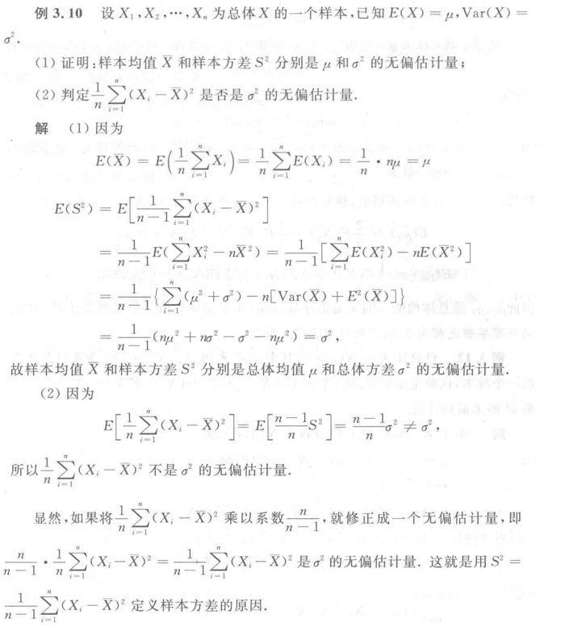

- [参数估计](#参数估计)
    - [点估计](#点估计)
    - [区间估计](#区间估计)
    - [区间估计的解题思路](#区间估计的解题思路)

---

# 参数估计
一般假定总体分布形式已知，未知几个参数

利用样本对其参数做出估计

### 点估计

用 $\hat{\theta}$ 去估计 $\theta$

用一个点去估计另一个点

① ==矩估计方法==

样本矩 $\longrightarrow$ 总体矩阵

(矩估计量)

比如用样本均值估计总体的期望 $\mu=\bar{X}=\displaystyle\frac{1}{n}\sum_{}^{}X_i$

② ==极大似然估计方法==

离散 $max\ \displaystyle\prod_{k=1}^{n}P(x_i,\theta)$

连续 $max\ \displaystyle\prod_{k=1}^{n}f(x_i,\theta)\ {\rm d}x_i\implies\displaystyle\prod_{k=1}^{n}f(x_i,\theta)$

(最大似然估计量)

③ ==点估计的优良准则==
1. 无偏性

$\qquad \hat{\theta}=\hat{\theta}(X_1,X_2,\cdots,X_n)$

$\qquad E(\hat{\theta})=\theta$

2. 有效性

$\qquad D(\hat{\theta_1})\leq D(\hat{\theta_2})$ 则 $\theta_1$ 更有效

3. 组合性

$\qquad \displaystyle\lim_{{n}\to{\infty}}\{|\hat{\theta}-\theta|<\varepsilon\}=1$

4. 渐进正态性

$\qquad X_i\backsim N(\mu,\sigma^2)\quad(n\to\infty)$

**最小方差无偏估计量** 是比较理想的估计量

> **无偏性**的例子
> 
> 从这个例子我们还可以体会到 样本方差 定义为 $\frac{1}{n-1}$ 而不是 $\frac{1}{n}$ 的好处
> 
> 

### 区间估计
估计出 $\bold{\theta}$ 的范围，同时给出**可信程度**

$P\{\theta_1(X_1,X_2,\cdots,X_n)\leq\theta\leq\theta_2(X_1,X_2,\cdots,X_n)\}=1-\alpha$

$1-\alpha$ : 置信系数(水平) $\qquad[\theta_1,\theta_2]$ : 置信区间

我们的目的：

在给定**置信水平**之下，去寻找有优良精度的**区间**。即在已知 $\alpha$ 的情况下，求 $[\theta_1,\theta_2]$

( 这一点是关键 )

① ==枢轴变量法==

$
\begin{aligned}
P\{a\leq F(\hat{\theta},\theta)\leq b\}=1-\alpha\\
\\
\implies P\{\theta_1\leq\theta\leq\theta_2\}=1-\alpha\\
\end{aligned}$

例子：

比如我们求 $\mu$ 在 $1-\alpha$ 下的区间

$\begin{aligned}
\qquad P\{-t_\frac{2}{\alpha}(n-1)\leq \overbrace{\boxed{ t(n-1)}}^{枢轴函数}\leq t_\frac{2}{\alpha}(n-1)\}=1-\alpha\\\\
\qquad\implies P\{\bar{X}-\displaystyle\frac{S}{\sqrt[]{n}}t_\frac{2}{\alpha}(n-1)\leq\mu\leq\bar{X}+\displaystyle\frac{S}{\sqrt[]{n}}t_\frac{2}{\alpha}(n-1)\}=1-\alpha
\end{aligned}$

② ==大样本法==

利用中心极限定理建立**数轴变量**

### 区间估计的解题思路
利用 [正态总体的样本均值与样本方差的分布](#正态总体的样本均值与样本方差的分布)

比如你会发现 

$\qquad (n-1)\displaystyle\frac{S^2}{\sigma^2}\backsim \chi^2(n-1)$

$\qquad$ 若我们想求 $\sigma$ 在 $p$ 下的估计区间

$\qquad$ 即要求得 $P\{\sigma \in A \}=p$

$\qquad$ 只需构建 $P\{\left((n-1)\displaystyle\frac{S^2}{\sigma^2}\right)\in B\}=p$

$\qquad$ 先由 $p$ 和 $(n-1)\displaystyle\frac{S^2}{\sigma^2}$ 的分布求得 $B$

$\qquad$ 剩下的 $\left((n-1)\displaystyle\frac{S^2}{\sigma^2}\right)\in B$ 中只有 $\sigma$ 一个未知量，解开就行
