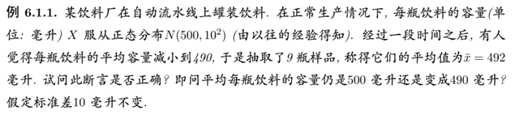

- [假设检验](#假设检验)
    - [基本概念](#基本概念)
    - [重要参数检验](#重要参数检验)
    - [拟合优度检验](#拟合优度检验)

---

# 假设检验
用**样本**检验对总体分布性质的**假设**

### 基本概念
① 基本概念

我们围绕解决下面问题来展开

$\bar{x}=492$

$H_0:\mu=500$ **原假设或零假设**
$H_1:\mu=490$ **对立假设**

$W=\{\bar{X}<\tau\}$ ( $\tau$ 将是我们重点求解的对象 )
$W$ 是**拒绝域**
样本落在拒绝域中，则拒绝 $H_0$

下面是对判断结果的分析
|                | $H_0$ 成立     | $H_1$ 成立     |
| :------------- | :------------- | :------------- |
| **接受 $H_0$** | 不犯错         | **第二类错误** |
| **拒绝 $H_0$** | **第一类错误** | 不犯错         |

我们的原则是在不犯第一类错误的基础上，尽量少犯第二类错误。

**我们的目的是**：在犯第一类错误的概率 $P(\bar{X}\in W|H_0 为真)=\alpha$ 的情况下，求拒绝域 ( 这是我们整个假设检验的核心，也是解题的关键式子 )

$\alpha$为**显著性水平**

现在取 $\alpha=0.05$

那么这题中我们的目的就是

在饮料的平均容量为 500 的情况下，我们的样本均值在拒绝域的概率为 0.05

$P\{\bar{X}<\tau\ |\ \theta=500\}=0.05$

$\implies P\{\displaystyle\frac{\sqrt[]{n}(\bar{X}-500)}{10}\backsim N(0,1)<\tau^{'}\}=0.05$

$\implies \tau^{'}=-\mu_{0.05}$

$\implies \bar{X}<495.ab\quad$ 这就是 $\alpha=0.05$ 的拒绝域

所以 $\bar{x}=492$ 在拒绝域中，假设正确

② 零假设的选取
1. 将受保护的对象置为零假设
2. 希望"证明" $P$ ，则取 $\lnot P$ 为零假设(一般在不清楚哪个应受保护的情况下)

我们的原则是不应该让受保护的对象去证明一个命题

> 如：在法院上，我们一般证明一个人有罪，而不是证明一个人无罪。因为我们认为把一个无辜的人错判这个件事是糟糕的，所以我们保护这个个人。

③ 解题步骤

上面的例题已很好的体现了解题步骤

### 重要参数检验
就是一些常见的参数检验的模式和情况。

没有太多要讲的。

### 拟合优度检验
不想写了。

